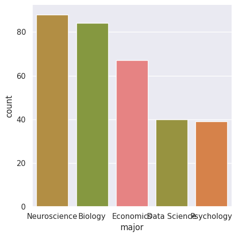
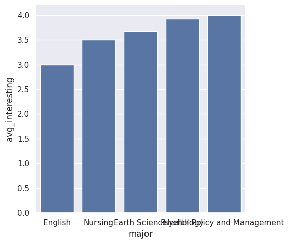
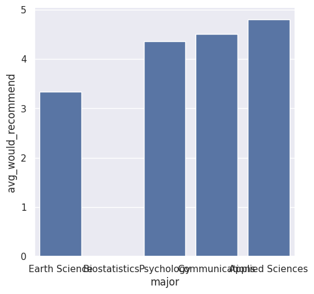

---
# Do not edit the text between these lines!
layout: default
---

# EX09: Data Analysis for Continuous Improvement
## Overview
The goal of this project was to analyze survey data from both Alyssa and Izzi's classes to determine how the course could be improved. My idea was to explore how students from different majors experience the class, specifically focusing on overall count, interest and recommendation levels(mostly the negatives). This data was all available in the surveys.

## Data
-majors 
-would recommend ratings
-interest ratings

I used this raw data to breakdown the majors by their proportion and find the overall count for each major. Similarly, I found the majors that had the lowest would recommend and interesting ratings and what that average rating(by major) was.

## Results and Findings
### Major Breakdown
Most Common majors in the class:
-Neuroscience: 88 students (~11.5%)
-Biology: 84 students (~10.9%)
-Economics: 67 students (~8.8)
-Data Science: 40 students (~5.2)
-Psychology: 39 (~5.1)

The classes are very STEM heavy, as presumed.

### Interest Level by Major
The lowest average interest scores included:
-English 3.0
-Nursing 3.5
-Earth Science: 3.67
The highest average interesting scores included:
-Radiology Sociology which both rated the class a 7.0

### Recommendation Ratings
The lowest recommendation scores included: 
-Earth Science: 3.33
-Biostatistics: 4.0
-Psychology: 4.36

The higher recommendation scores included:
-Sociology, Radiology, Math, Medical Anthropology and a couple more at 6 or above

## Graphs

## Conclusion
In my analysis, I successfully identified metrics and data that supported my initial question and idea. Moreover, I found metrics that could help improve the class's overall experience, as well as the population to which some of the content could be more tailored. In my summary table, I was able to group each major's count and proportion of the total population, average interesting rating, and average would recommend rating. I then created three charts based on this data. When I tried to graph all of the majors on one, I couldn't see any of the labels and realized it wasn't particularly helpful, so for the counts, I found the top 5 counts and graphed them, which would make up the majority of the class. I next found the bottom 5 levels of interesting and would recommend because these are the people that are having bad experiences in the class, and solutions need to be thought out according to those specific majors to make it more interesting to them. On my would recommend graph, there is a blank value or 0 for one of the majors, which shows it is a missing value, which I am interpreting as a negative because if you feel a strong positive toward a class, you wouldn't just skip through the questions, but the other values portray the negative ratings for certain majors. The findings in this analysis can be really important for helping future classes be more interested and enjoy the class more, which in turn makes it more fun and teachable for the professor.

Potential costs of targeting more of the population while also aiming to improve low recommendation and interest rates could result in a similar reaction across different major groups. For example, if certain majors really enjoyed the way our course's content is presented now and find it easy to learn and understand the material, they could be confused or frustrated with the new layout. Also, if you're an English major and the content is tailored towards the sciences, you might not be interested or like it. Personally, I think regardless of what major you are, a little variation and some interesting case studies or examples from a multitude of majors bring some flavor, but not everyone might agree. Also, it adds more strain to the professor as it's going to take more time to lesson plan, which they might not be willing to take on. Overall, there are possible costs, downsides, and trade-offs, but it really depends on the student, teacher, and major population. 

In the future, I could add more variables to the equation to analyze. This would fit the population better and not rely so heavily on a couple of indicators for the whole population. I would use unc_status to determine what year they were and determine interests based on this. For example, if the class is just seniors, maybe some real-world examples could be a benefit to them as they are preparing to go out into the workforce based on their majors. I would also analyze the difficulty and understanding rating by major and see if certain divisions are struggling because of any prior exposition or knowledge of this or related content. In all, there are so many valuable variables to use in determining how to improve the class experience for everyone, I think splitting it up by major and furthermore counting the number of that major to benefit as many people as possible would lead to a more interesting and recommendable class.
